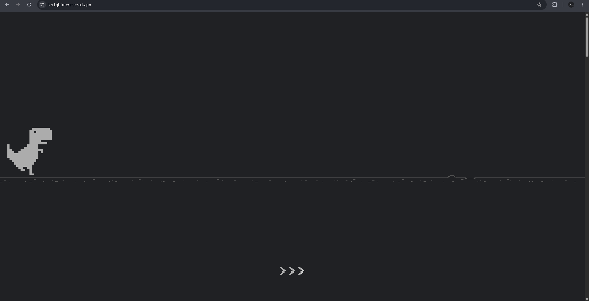
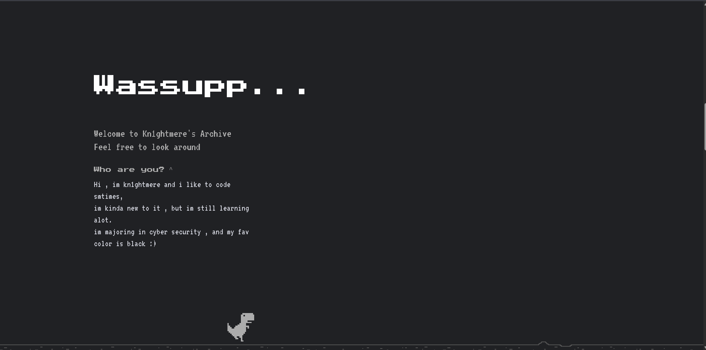

## Portfolio Site
https://kn1ghtmere.vercel.app/
this is a project for thirdspace.hackclub.com
im contributing with my friend
im working on the intro and site skeleton 
Hes working on Components such as navbar and Site Sections

# features:
-  The dino is interactable
-  it can be dragged , scrolled , and even by pressing space it moves
-  the dino changes directions according to scroll direction
-  the dino toggles the theme of the site on double clicking(ill add a hint for it too later)
-  the dino has a shrink and descend animation which is reversable
-  the home section , and various empty placeholders for later additions/merge
-  the about section has a dropdown.
-  oh yea it has themes duh

## Tech i used:
-  React plus Vite
-  Gsap for animations 
-  lenis for smooth scroll
-  tailwind css ofcourse (new to it , i like it) 
-  pnpm (my fren said its better den npm smhow)
-  vercel for deployement
-  git n github for version control n commits n stuff ofcourse
-  the goat claude (excellent debugger plus good for learning bout gsap plugins n stuff)
-  vscode my only editor
-  does my pc count as tech? 
-  what qualifies as tech ? uh "used my brain 😊"

# screenshots:
this is how it shuld look like: (works on my device):

