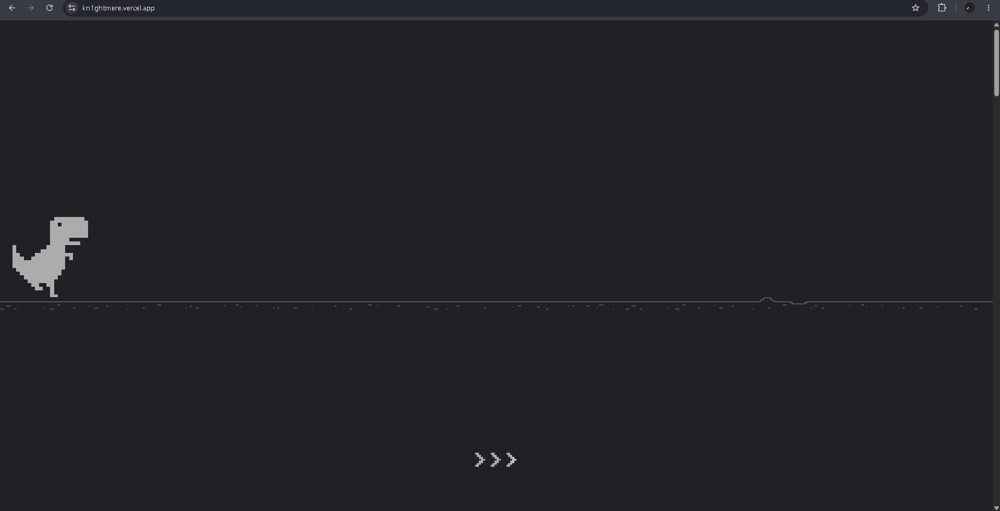
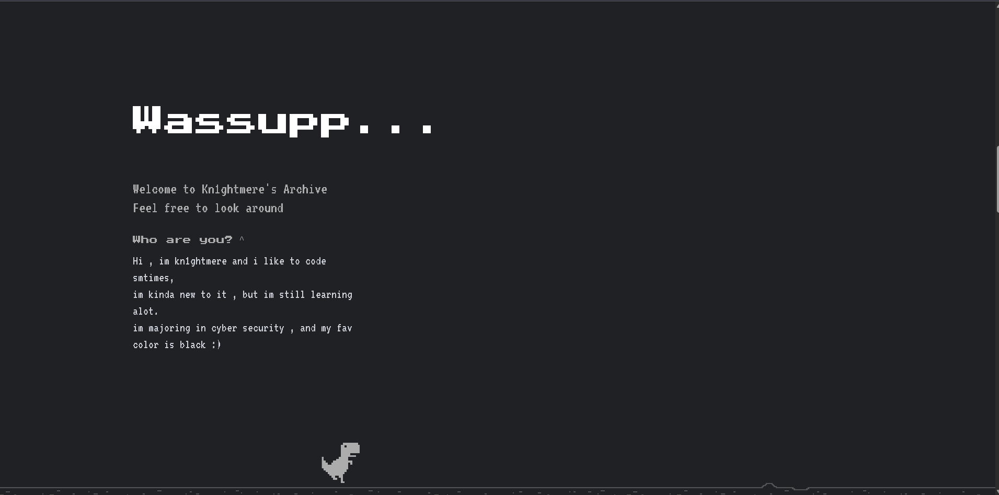
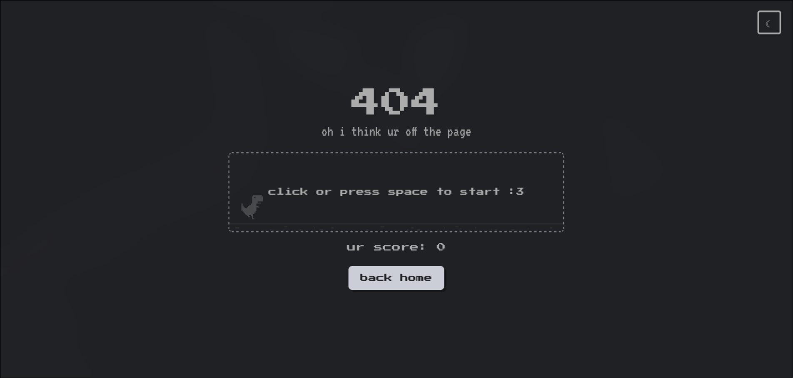

# Portfolio Site
https://kn1ghtmere.vercel.app

this is a project fot thirdspace.hackclub.com, Me and my friend are working as a team.

## Contibutions:
### Kn1ghtmere:
-  Started with setting up main.
-  Set up own branch (https://github.com/.Kn1ghtmere/portfolio-site/tree/knight)
-  Kept commiting to own branch, then created a test branch(https://github.com/Kn1ghtmere/portfolio-site/tree/falooda) to merge the sections that subhanali07 had added to his branch (https://github.com/Kn1ghtmere/portfolio-site/tree/subhan-code).
-  continued to work on own branch (https://github.com/Kn1ghtmere/portfolio-site/tree/kn1ght).
-  kept importing components from subhanali07's work on /falooda (https://github.com/Kn1ghtmere/portfolio-site/tree/falooda) to make it easier to push to main later.
-  made own branch default cuz, alr merged everyting to it so don need main branch anymore.

### subhanali07:
-  helped setup main.
-  set up own branch (https://github.com/Kn1ghtmere/portfolio-site/tree/subhan-code)
-  worked on own branch created components and sections.
-  switched to branch /falooda (https://github.com/Kn1ghtmere/portfolio-site/tree/falooda) after the merge cuz it was easier to test components.
-  kept committing changes to /falooda.
-  kept adding stuff.
-  all changes from my branch got imported into (https://github.com/Kn1ghtmere/portfolio-site/tree/knight).

# features:
-  interactable dino icon to navigate page(its operational thru drag, scroll, spacebar and arrow keys).
-  horizontal scrolling for large screen(computer & laptops) and a simplified normal versiom for small screens.
-  navbar, navbar transitions, navbar links.
-  dino transitions, ground transitions(till the footer).
-  home page, with dropdown about section.
-  work page with past projects. 
-  a contact page with emailjs.
-  a 404 page with a builtin game ( we copied discord).
-  cursor trail, trail of pixels follow the cursor.
-  oh and super smooth scrolling and momentum with lenis.
-  a super cool footer.
-  themes, everything has a theme, everything, even the 404 page,
-  its all black and white.

## tech WE used: 
-  react plus vite.
-  gsap for animations
-  lenis for smooth scroll.
-  react-icons.
-  react-router-dom
-  tailwindcss(its convenient)
-  pnpm (my frend says npm is infested so pnpm is better to use).
-  vercel for deployment.
-  git n github for version control n commits n history of code.
-  the goat claude (excellent debugging plus good for learning bout gsap plugins and its stuff).
-  vscode our beloved(one of the best code editors out there)
-  Kn1ghmere used windows 11 and subhan used fedora linux 43 and hyprland as its DE.
- does my pc and his laptop count as tech??
- what qualifies as tech?? uhh "used my brain hehe"

